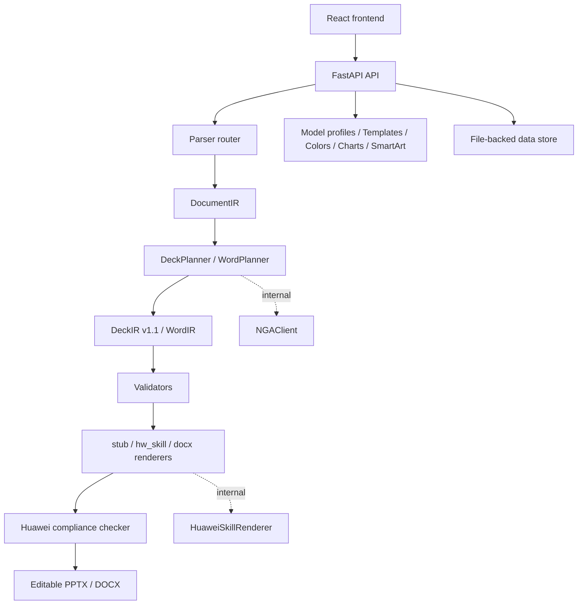

# Architecture

`doc-agent-mvp` is a local enterprise document generation pipeline.

## Backend Modules

- `doc_agent/parsers`: parse `md/docx/pptx` into `DocumentIR`.
- `doc_agent/agent`: own `AgentRunRequest`, `AgentRunContext`, `AgentRunResult`, and task execution orchestration.
- `doc_agent/planners`: call the LLM socket to produce `DeckIR` or `WordIR`; external default is `stub`, local HTTP proxy mode is `local_relay`, and internal target is `nga`.
- `doc_agent/renderers`: render editable Office files.
- `doc_agent/compliance`: review PPTX output against Huawei-style static rules.
- `doc_agent/exporters`: export Office pages to PNG previews through LibreOffice and Poppler.
- `doc_agent/validators`: validate and fix IR and output files.
- `doc_agent/users`: store local model profile configuration for NGA/OpenAI-compatible endpoints.
- `doc_agent/templates`: manage system and imported PPTX templates.
- `doc_agent/colors`: manage and recommend color schemes.
- `doc_agent/charts`: recommend chart types and return chart IR.
- `doc_agent/smartart`: return SmartArt-style IR.
- `doc_agent/api`: FastAPI routers for the extended backend.

## IR Contracts

- `DeckIR v1.1` is the stable PPT contract between planners and renderers.
- Legacy layouts remain supported: `cover`, `agenda`, `section`, `title_bullets`, `two_column`, `table`, `conclusion`.
- Extended layouts are available for Huawei-style growth: `cards`, `chart`, and `image`.
- Optional metadata fields such as `source_refs`, `intent`, `importance`, `visuals`, `chart`, `footer`, and `confidentiality` are forward-compatible; stub rendering handles them conservatively, while the intranet Skill can map them to richer layouts.

## Frontend Modules

- `components/Layout`: sidebar, header, and shell.
- `components/DocumentGenerator`: upload, generation form, progress, result download, and generation history.
- `components/DesignSystem`: templates and colors as mainline tools; chart and SmartArt remain auxiliary design tools.
- `components/ConfigManager`: model profile config and personal import/export.
- `store`: Zustand stores for users, document progress, templates, colors, and UI state.
- `services`: Axios API client, WebSocket progress helper, and file helpers.

## Runtime Data

Local runtime data lives under `data/`:

- `data/users`: encrypted model profile tokens and current-profile pointer.
- `data/templates`: template metadata and imported PPTX files.
- `data/colors`: color scheme JSON.
- `data/tasks`: async generation progress and history JSON.
- `data/uploads`: uploaded source files.
- `data/logs`: JSON request logs with daily rotation.

Generated outputs live under `outputs/`.

## Security Boundaries

- Default local mode uses `LLM_PROVIDER=stub` and `PPT_RENDERER=stub`.
- Local relay mode uses `LLM_PROVIDER=local_relay` and sends the main agent prompt to `LLM_BASE_URL/generate_json`.
- NGA and Huawei Skill requests only happen after the internal adapters are implemented and selected.
- Legacy OpenAI-compatible requests only happen when explicitly configured through env or a restored profile.
- API export masks tokens. Import requires plaintext tokens if a model profile should be usable.
- `/api/profiles` is the product-facing model-profile alias; `/api/users` remains as the backward-compatible storage/API prefix.
- The local token seal prevents plaintext leakage at rest, but production deployments should replace it with audited key management.
